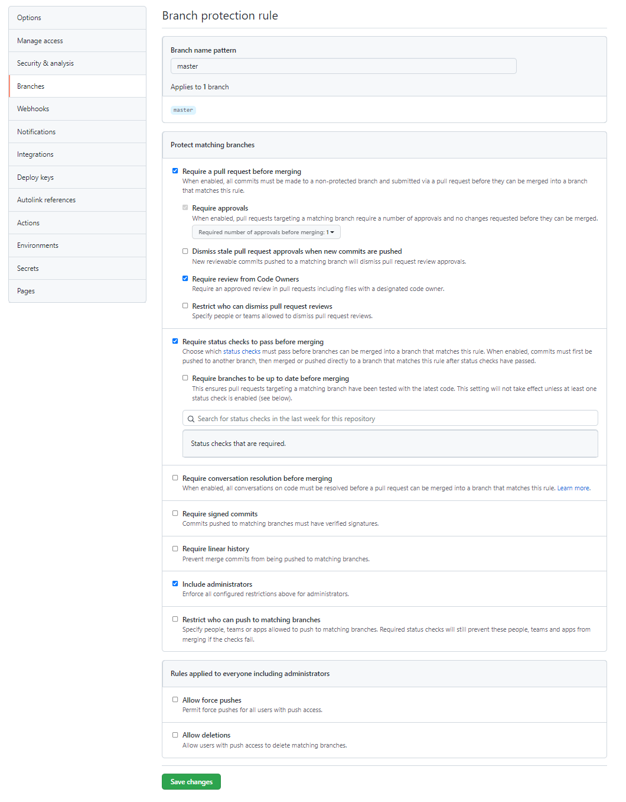

# Standard Repo Setup

1. Go to https://github.com/department-of-veterans-affairs
2. Click the green new button and give repo a name in kebab case starting with the word lighthouse e.g. (lighthouse-repo-name). Leave radio button set to Internal. 
3. Select checkboxes for add README and .gitignore
4. Click create repository
5. Once the repo is created go into `Settings -> Manage access` and add the `lighthouse-bandicoot` team as admins. Then remove your username from admins. We want to only rely on team admin access.
6. While still in `Settings`, go to `Branches -> Branch protection rules -> Edit`. Set options according to the below image:

    

7. Click the green `Save changes` button at the bottom.
8. Add a CODEOWNERS file to the root of the repo. See below for contents of file:
    ```
    # Lines starting with '#' are comments.
    # Each line is a file pattern followed by one or more owners.

    # More details are here: https://help.github.com/articles/about-codeowners/

    # The '*' pattern is global owners.

    # Order is important. The last matching pattern has the most precedence.
    # The folders are ordered as follows:

    # In each subsection folders are ordered first by depth, then alphabetically.
    # This should make it easy to add new rules without breaking existing ones.

    # Global rule:
    *   @department-of-veterans-affairs/lighthouse-bandicoot
    ```
    Check [here](https://help.github.com/articles/about-codeowners/) for more details on CODEOWNERS files

9. Add [allstar](./allstar.md) to the repo. You cant do this directly. Go to https://github.com/department-of-veterans-affairs/github-user-requests/issues `-> New issue -> General Help Request` and click the green `Get started` button.

    a. Set title to `Install Allstar GitHub App for <repo-name>`  
    b. In the `Request Information` field add the following:
    ```
    Our team wanted to use the Allstar GitHub App to create and enforce custom security policies for our repo <repo-name> but it requires an organization owner to install it. Is it possible to have this app installed for our repo? Thanks
    ```
11. Click `Submit new issue`